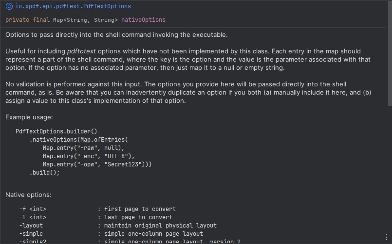

= Xpdf API
//TODO: automatically inject build status, like spring boot project does
//TODO: look at other readme with .adoc structure, and see what other ways there are to format this. for example, spring boot has tabs for "Security" and "Code of Conduct" - pretty cool!

Xpdf API is a collection of Java APIs for https://www.xpdfreader.com/about.html[Xpdf], an open source library for working with PDF files written in C++.
Xpdf is an invaluable PDF toolkit, and this project aims to make it more accessible to the Java community.

Our primary goals are:

* Provide full programmatic access to Xpdf.
* Act as a pure, unobscured interface to Xpdf.

APIs are available for the following Xpdf functions (with more to come):

* _pdftotext_ - convert PDF files to text

== Getting Started

=== Requirements

* JDK 8 or later
* Windows, Linux, or Mac OS

=== Dependencies
//TODO: automatically inject maven central references with latest versions
//TODO: is there a way to provide a code block with tabs, so users can choose between all dependencies in single block?

[source,xml]
----
 <dependency>
     <groupId>io.xpdf.api</groupId>
     <artifactId>pdf-text-api</artifactId>
     <version>1.0.0</version>
 </dependency>
----

...or a Spring Boot starter, for the _fancy_ developers!

[source,xml]
----
 <dependency>
     <groupId>io.xpdf.api</groupId>
     <artifactId>pdf-text-api-spring-boot-starter</artifactId>
     <version>1.0.0</version>
 </dependency>
----

== PdfText API
//TODO: do we want image in source code? or should we host on website, and link to that?

*Important:* We provide information about this tool below, but we highly recommend downloading sources in your IDE so that you have full access to our JavaDocs.
We made an extra effort to provide you with all the help you need, directly from your editor.

=== Usage

Simple example:

[source,java,indent=0]
----
    // initialize the tool
    PdfTextTool pdfTextTool = PdfTextTool.builder().build();

    // build a request with a PDF file
    PdfTextRequest request = PdfTextRequest.builder()
            .pdfFile(new File("C:/docs/some.pdf"))
            .build();

    // convert the PDF into a text file
    PdfTextResponse response = pdfTextTool.process(request);
----

Complex example:

[source,java,indent=0]
----
    PdfTextTool pdfTextTool = PdfTextTool.builder().build();

    // add some options to customize your request
    PdfTextOptions options = PdfTextOptions.builder()
            .format(PdfTextFormat.TABLE)
            .encoding(PdfTextEncoding.UTF_8)
            .ownerPassword("Secret123")
            .nativeOptions(Map.ofEntries(Map.entry("-cfg", "C:/config/xpdfrc")))
            .build();

    // build a request with options, and specify an output text file
    PdfTextRequest request = PdfTextRequest.builder()
            .pdfFile(new File("C:/docs/some.pdf"))
            .textFile(new File("C:/docs/some.txt"))
            .options(options)
            .build();

    PdfTextResponse response = pdfTextTool.process(request);
----

=== Configuration
//TODO

==== PdfTextTool

`PdfTextTool` represents Xpdf's _pdftotext_ command line tool.
It is a simple service that allows you to programmatically execute shell commands against _pdftotext_, which is included with this project in an executable format for Windows, Linux, and Mac operating system.

Default configuration of `PdfTextTool` is to use the executable provided in our project resources, with a 30 second timeout on individual invocations.

[source,java,indent=0]
----
    PdfTextTool pdfTextTool = PdfTextTool.builder().build();
----

If you want to use your own installation of _pdftotext_, then you can download it from Xpdf https://www.xpdfreader.com/download.html[here]. Timeout can be configured also, but unless you are working with truly massive PDF files, most executions happen in under a second.
[source,java,indent=0]
----
    PdfTextTool.builder()
            .executableFile(new File("C:/libs/pdftotext.exe"))
            .timeoutSeconds(60)
            .build();
----

If you are using our Spring Boot starter, just plug in the following properties.
[source,yaml,indent=0]
----
io.xpdf.api.pdftext:
      executable-path: "C:/libs/pdftotext.exe"
      timeout-seconds: 60
----

==== PdfTextRequest

`PdfTextRequest` represents an individual shell command to invoke _pdftotext_.

==== PdfTextRequest

`PdfTextResponse` represents the result of invoking _pdftotext_.

==== Logging

== Getting Help
TODO

== Reporting Issues
TODO

== Building From Source

You do not need to build this project locally to use Xpdf API (packages are available in the Maven Central Repository).

But if you wish to build anyway, all you need is JDK 8 and our provided Maven wrapper.

[source,bash,indent=0]
----
    $ ./mvnw install
----

== License

Xpdf API is Open Source software released under the https://www.gnu.org/licenses/gpl-3.0.html[GNU General Public License, version 3 (GPLv3)].