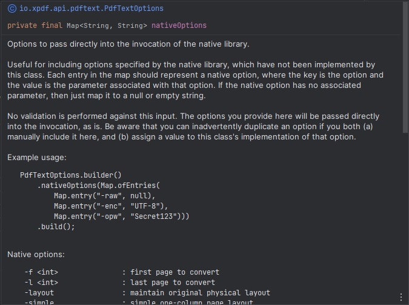

= Xpdf API

Xpdf API is a collection of Java APIs for https://www.xpdfreader.com/about.html[Xpdf], an open source library for working with PDF files written in C++.
Xpdf is an invaluable PDF toolkit, and this project aims to make it more accessible to the Java community.

Our primary goals are:

* Provide full programmatic access to Xpdf.
* Act as a pure, unobscured interface to Xpdf.

APIs are available for the following Xpdf functions (with more to come):

* _pdftotext_ - convert PDF files to text

== Getting Started

=== Requirements

* JDK 8+
* Windows, Linux, or Mac OS

=== Dependency

TODO: automatically inject maven central references with latest versions

[source,xml]
----
 <dependency>
     <groupId>io.xpdf.api</groupId>
     <artifactId>pdf-text-api</artifactId>
     <version>1.0.0</version>
 </dependency>
----

...or a Spring Boot starter, for the _fancy_ developers!

[source,xml]
----
 <dependency>
     <groupId>io.xpdf.api</groupId>
     <artifactId>pdf-text-api-spring-boot-starter</artifactId>
     <version>1.0.0</version>
 </dependency>
----

=== PdfTextTool

*Important:* We provide a couple usages of this tool below, but we highly recommend downloading sources in your IDE so you have full access to our JavaDocs.
We made an extra effort to provide you with all the help you need, directly from your editor.

Simple Example:

[source,java,indent=0]
----
    // initialize the tool
    PdfTextTool pdfTextTool = PdfTextTool.builder().build();

    // build a request with a PDF file
    PdfTextRequest request = PdfTextRequest.builder()
            .pdfFile(Paths.get("C:/docs/some.pdf"))
            .build();

    // convert the PDF into a text file
    PdfTextResponse response = pdfTextTool.process(request);
----

Complex Example:
[source,java,indent=0]
----
    PdfTextTool pdfTextTool = PdfTextTool.builder().build();

    // add some options to customize your request
    PdfTextOptions options = PdfTextOptions.builder()
            .format(PdfTextFormat.TABLE)
            .encoding(PdfTextEncoding.UTF_8)
            .ownerPassword("Secret123")
            .nativeOptions(Map.ofEntries(Map.entry("-cfg", "C:/config/xpdfrc")))
            .build();

    // build a request with options, and specify an output text file
    PdfTextRequest request = PdfTextRequest.builder()
            .pdfFile(Paths.get("C:/docs/some.pdf"))
            .textFile(Paths.get("C:/docs/some.txt"))
            .options(options)
            .build();

    PdfTextResponse response = pdfTextTool.process(request);
----

== How It Works

If you understand how to use Xpdf, then you should understand how to use this library.

== Configuration

Important:

If you haven't read the "How it works" section, read that first, then return here.

TODO: configurations

== Getting Help

TODO

== Reporting Issues

TODO

== Building From Source

You do not need to build this project locally to use Xpdf API (libraries are available in Maven Central Repository).

But if you wish to build anyway, all you need is JDK 8 and our provided Maven wrapper.

[source,bash,indent=0]
----
    $ ./mvnw install
----

== License

Xpdf API is Open Source software released under the https://www.gnu.org/licenses/gpl-3.0.html[GNU General Public License, version 3 (GPLv3)].